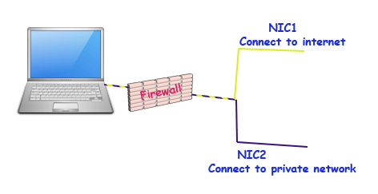
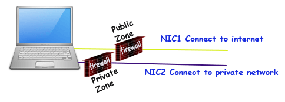

# Firewalld Basic concepts Explained with Examples

This tutorial explains basic concepts of firewalld zones, services, port and rich rules and firewalld terminology (Trusted, home, internal, work, public, external, Dmz, block and drop) in detail with examples. Learn how to enable firewalld service, disable iptables service, what firewalld is and how it works in Linux step by step.

Firewalld is the new concept and default tool to manage the host based Firewall in Centos/RHEL7.0. In earlier version, *iptables* was used to manage the firewall. The *iptables* service still exist, but it should not be used to manage the firewall.

**Firewalld** has several advantages over *iptables*. Such as *iptables* uses three separate services for IPv4 (*iptables*), IPv6 (*ip6tables*) and software bridging (*ebtables*). While **firewalld** uses single service for all three settings. **Firewalld** uses DBus messing system which allows us add remove rules / ports from running firewall. With this feature, we don’t have to restart the firewall each time when we make changes. Such a facility was not available in iptables. Unless you have any specific reason to use iptables, always use firewalld service to manage the firewall.

## Disabling iptables service

Firewalld is incompatible with *iptables* and should never be used with it. Running both services simultaneously will mess-up the firewall. Whatever service you choose, disable and mask the other.

There are three iptables services:-

- iptables for IPv4 configuration
- ip6tables for IPv6 configuration
- ebtables for software bridge

We can disable these services individually with following commands

```shell
systemctl disable iptables
systemctl disable ip6tables
systemctl disable ebtables
```

In multi-user environment, other user may enable ***iptables*** service again accidentally or intentionally. To stop iptables service completely we can mask it. A masked service cannot be started manually or automatically.

To mask all *iptables* services we can use following commands

```shell
systemctl mask iptables
systemctl mask ip6tables
systemctl mask ebtables
```

## Enabling firewalld Service

If you have just disabled the active iptables service and trying to enable the firewalld service then firewalld service may not be start. Switching from iptables to firewalld requires a system restart. First disable and mask active iptables services and restart the system. Then enable and start the firewalld service.

To check the current status of firewalld service we can use following command.

```shell
systemctl status firewalld
```

If firewalld service is masked, it will never start. We have to unmasked the firewalld service before we can start it. To unmask the firewalld service we can use following command:-

```shell
systemctl unmask firewalld
```

Once unmasked, we can start it with following command:-

```shell
systemctl start firewalld
```

With ***start*** option service will start only for this session. To start it permanently we have to use ***enable*** option.

```shell
systemctl enable firewalld
```

Before we start working with firewalld, make sure firewalld service is active and running.

## Zone

For easier management firewalld categorizes the incoming traffic in Zone based on interface and source address. Zones are created to handle the similar traffic separately. Let’s understand it with an example.

Suppose we have a server which has two LAN cards. First LAN card is connected with public network (such as internet) and second LAN card is connected with private network. Server has following security requirements :-

- Open HTTP port (80) and block all remaining ports for public network.
- Open FTP port (21) and block all remaining ports for private network.

To understand how zone concept makes management easier, let’s create firewall rules for above requirements

### Without Zone concept

- If packet is coming for port 80 then check from where it is coming. If it is coming from public network, allow it. If it is coming from private network, deny it.
- If packet is coming for port 21 then check from where it is coming. If it is coming from public network, deny it. If it is coming from private network, allow it.
- If packet is coming for other port except 80 or 21 then deny it.



### With Zone concept

Zone concept allows us to divide incoming traffic based on NICs. Since first NIC is connected with public network and second NIC is connected with private network, we can create two separate zones; public zone for first NIC and private zone for second NIC. Assign first NIC in public zone and second NIC in private zone.

#### Rules in public zone

If packet is coming for port 80, allow it. If packet is not coming for port 80, deny it.

#### Rules in private zone

If packet is coming for port 21, allow it. If packet is not coming for port 21, deny it.



As we can see managing firewall with zone is much easier than without zone.

Firewalld includes following pre-defined zones based on the level of trust we have on incoming traffic.

| Name     | Description                                                  |
| -------- | ------------------------------------------------------------ |
| Trusted  | This zone allows all incoming traffic. On trust scale, it stands on first position. Use this zone to handle the traffic on which you can trust blindly because it filters nothing. |
| Home     | This zone is customized for home network. It allows return traffic with following services ssh, mdns, ipp-client, samba-client and dhcpv6-client. |
| Internal | This zone is similar to home zone but it is customized for internal network. It also allows return traffic with following services ssh, mdns, ipp-client, samba-client and dhcpv6-client. |
| Work     | This zone is customized for work network. It allows return traffic with following services ssh, ipp-client and dhcpv6-client. |
| Public   | This zone is customized for public network. It allows return traffic with following services ssh and dhcpv6-client. This is the default zone unless you change the setting. |
| External | This zone is customized for masquerading. It allows return traffic and ssh service only. |
| Dmz      | This zone is customized to limit the access to internal network. It allows return traffic and ssh service only. |
| Block    | This zone rejects all incoming traffic with “icmp-host-prohibited” message. It allows only return traffic. On trust scale it stands on second last position. |
| Drop     | This zone rejects all incoming traffic without sending any error message. It allows only return traffic. On trust scale it stands on last position. |

Return Traffic :- *The traffic which arrives in response of the connection made from this computer*.

##### Key points

- When a packet arrives in system, firewalld checks its source address to find out whether that address belongs to any specific zone. If yes then packet will be filtered by that specific zone. This allows us to define and activate multiple zones even if there is only one NIC is available in system.
- If packet does not belongs to any specific zone based on source address then firewalld tries to find out the zone based on the interface from which packet entered in system. If NIC on which packet arrived belong to any specific zone, packet will be filtered by that specific zone.
- If source address and NIC on which packet arrived do not belong to any specific zone, packet will be filtered by the default zone.
- Default zone is set to public zone. We can set any other zone or custom zone as default.
- Each zone has its own rules for services and ports which are opened or closed.
- As per requirement, we can create new zone or update existing zones.
- System pre-defined zone files are stored in ***/usr/lib/firewalld/zones\*** while any custom zones files are stored in ***/etc/firewalld/zone\*** location.
