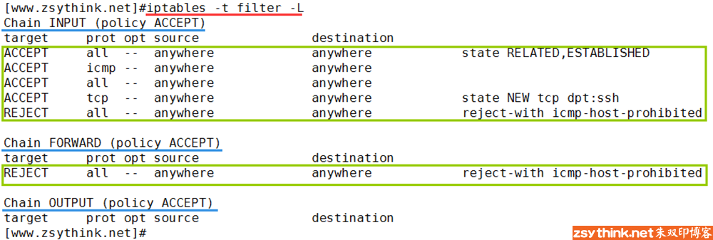
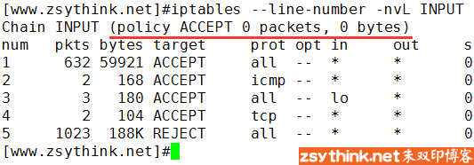

# [iptables详解2：iptables实际操作之规则查询](https://www.zsythink.net/archives/1493)

在进行iptables实验时，请务必在测试机上进行。

之前在iptables的概念中已经提到过，在实际操作iptables的过程中，是以”表”作为操作入口的，如果你经常操作关系型数据库，那么当你听到”表”这个词的时候，你可能会联想到另一个词—-“增删改查”，当我们定义iptables规则时，所做的操作其实类似于”增删改查”，那么，我们就先从最简单的”查”操作入手，开始实际操作iptables。

在之前的文章中，我们已经总结过，iptables为我们预定义了4张表，它们分别是raw表、mangle表、nat表、filter表，不同的表拥有不同的功能。

filter负责过滤功能，比如允许哪些IP地址访问，拒绝哪些IP地址访问，允许访问哪些端口，禁止访问哪些端口，filter表会根据我们定义的规则进行过滤，filter表应该是我们最常用到的表了，所以此处，我们以filter表为例，开始学习怎样实际操作iptables。

怎样查看filter表中的规则呢？使用如下命令即可查看。



上例中，我们使用-t选项，指定要操作的表，使用-L选项，查看-t选项对应的表的规则，-L选项的意思是，列出规则，所以，上述命令的含义为列出filter表的所有规则，注意，上图中显示的规则（绿色标注的部分为规则）是Centos6启动iptables以后默认设置的规则，我们暂且不用在意它们，上图中，显示出了3条链（蓝色标注部分为链），INPUT链、FORWARD链、OUTPUT链，每条链中都有自己的规则，前文中，我们打过一个比方，把”链”比作”关卡”，不同的”关卡”拥有不同的能力，所以，从上图中可以看出，INPUT链、FORWARD链、OUTPUT链都拥有”过滤”的能力，所以，当我们要定义某条”过滤”的规则时，我们会在filter表中定义，但是具体在哪条”链”上定义规则呢？这取决于我们的工作场景。比如，我们需要禁止某个IP地址访问我们的主机，我们则需要在INPUT链上定义规则。因为，我们在理论总结中已经提到过，报文发往本机时，会经过PREROUTING链与INPUT链（如果你没有明白，请回顾前文），所以，如果我们想要禁止某些报文发往本机，我们只能在PREROUTING链和INPUT链中定义规则，但是PREROUTING链并不存在于filter表中，换句话说就是，PREROUTING关卡天生就没有过滤的能力，所以，我们只能在INPUT链中定义，当然，如果是其他工作场景，可能需要在FORWARD链或者OUTPUT链中定义过滤规则。

话说回来，我们继续聊怎样查看某张表中的规则。

刚才提到，我们可以使用iptables -t filter -L命令列出filter表中的所有规则，那么举一反三，我们也可以查看其它表中的规则，示例如下。

iptables -t raw -L

iptables -t mangle -L

iptables -t nat -L

其实，我们可以省略-t filter，当没有使用-t选项指定表时，默认为操作filter表，即iptables -L表示列出filter表中的所有规则。

我们还可以只查看指定表中的指定链的规则，比如，我们只查看filter表中INPUT链的规则，示例如下（注意大小写）。


上图中只显示了filter表中INPUT链中的规则（省略-t选项默认为filter表），当然，你也可以指定只查看其他链，其实，我们查看到的信息还不是最详细的信息，我们可以使用-v选项，查看出更多的、更详细的信息，示例如下。


可以看到，使用-v选项后，iptables为我们展示的信息更多了，那么，这些字段都是什么意思呢？我们来总结一下，看不懂没关系，等到实际使用的时候，自然会明白，此处大概了解一下即可。

其实，这些字段就是规则对应的属性，说白了就是规则的各种信息，那么我们来总结一下这些字段的含义。

**pkts**:对应规则匹配到的报文的个数。

**bytes**:对应匹配到的报文包的大小总和。

**target**:规则对应的target，往往表示规则对应的”动作”，即规则匹配成功后需要采取的措施。

**prot**:表示规则对应的协议，是否只针对某些协议应用此规则。

**opt**:表示规则对应的选项。

**in**:表示数据包由哪个接口(网卡)流入，即从哪个网卡来。

**out**:表示数据包将由哪个接口(网卡)流出，即到哪个网卡去。

**source**:表示规则对应的源头地址，可以是一个IP，也可以是一个网段。

**destination**:表示规则对应的目标地址。可以是一个IP，也可以是一个网段。

细心如你一定发现了，上图中的源地址与目标地址都为anywhere，看来，iptables默认为我们进行了名称解析，但是在规则非常多的情况下如果进行名称解析，效率会比较低，所以，在没有此需求的情况下，我们可以使用-n选项，表示不对IP地址进行名称反解，直接显示IP地址，示例如下。


如上图所示，规则中的源地址与目标地址已经显示为IP，而非转换后的名称。

当然，我们也可以只查看某个链的规则，并且不让IP进行反解，这样更清晰一些，比如 iptables -nvL INPUT

如果你习惯了查看有序号的列表，你在查看iptables表中的规则时肯定会很不爽，没有关系，满足你，使用–line-numbers即可显示规则的编号，示例如下。


–line-numbers选项并没有对应的短选项，不过我们缩写成--line时，centos中的iptables也可以识别。

我知道你目光如炬，你可能早就发现了，表中的每个链的后面都有一个括号，括'c'号里面有一些信息，如下图红色标注位置，那么这些信息都代表了什么呢？我们来看看。



上图中INPUT链后面的括号中包含policy ACCEPT ，0 packets，0bytes 三部分。

**policy**表示当前链的默认策略，policy
ACCEPT表示上图中INPUT的链的默认动作为ACCEPT，换句话说就是，默认接受通过INPUT关卡的所有请求，所以我们在配置INPUT链的具体规则时，应该将需要拒绝的请求配置到规则中，说白了就是”黑名单”机制，默认所有人都能通过，只有指定的人不能通过，当我们把INPUT链默认动作设置为接受(
ACCEPT)，就表示所有人都能通过这个关卡，此时就应该在具体的规则中指定需要拒绝的请求，就表示只有指定的人不能通过这个关卡，这就是黑名单机制，**但是**，你一定发现了，上图中所显示出的规则，大部分都是接受请求(ACCEPT)
，并不是想象中的拒绝请求(DROP或者REJECT)
，这与我们所描述的黑名单机制不符啊，按照道理来说，默认动作为接受，就应该在具体的规则中配置需要拒绝的人，但是上图中并不是这样的，之所以出现上图中的情况，是因为IPTABLES的工作机制导致到，上例其实是利用了这些”机制”，完成了所谓的”白名单”机制，并不是我们所描述的”黑名单”机制，我们此处暂时不用关注这一点，之后会进行详细的举例并解释，此处我们只要明白policy对应的动作为链的默认动作即可，或者换句话说，我们只要理解，policy为链的默认策略即可。

**packets**表示当前链（上例为INPUT链）默认策略匹配到的包的数量，0 packets表示默认策略匹配到0个包。

**bytes**表示当前链默认策略匹配到的所有包的大小总和。

其实，我们可以把packets与bytes称作”计数器”，上图中的计数器记录了默认策略匹配到的报文数量与总大小，”计数器”只会在使用-v选项时，才会显示出来。

当被匹配到的包达到一定数量时，计数器会自动将匹配到的包的大小转换为可读性较高的单位，如下图所示。


如果你想要查看精确的计数值，而不是经过可读性优化过的计数值，那么你可以使用-x选项，表示显示精确的计数值，示例如下。


每张表中的每条链都有自己的计数器，链中的每个规则也都有自己的计数器，没错，就是每条规则对应的pkts字段与bytes字段的信息。

## 命令小节

好了，我们已经会使用命令简单的查看iptables表的规则了，为了方便以后回顾，我们将上文中的相关命令总结一下。

```
iptables -t 表名 -L
```

查看对应表的所有规则，-t选项指定要操作的表，省略”-t 表名”时，默认表示操作filter表，-L表示列出规则，即查看规则。

```
iptables -t 表名 -L 链名
```

查看指定表的指定链中的规则。

```
iptables -t 表名 -v -L
```

查看指定表的所有规则，并且显示更详细的信息（更多字段），-v表示verbose，表示详细的，冗长的，当使用-v选项时，会显示出”计数器”的信息，由于上例中使用的选项都是短选项，所以一般简写为iptables -t 表名 -vL

```
iptables -t 表名 -n -L
```

表示查看表的所有规则，并且在显示规则时，不对规则中的IP或者端口进行名称反解，-n选项表示不解析IP地址。

```
iptables --line-numbers -t 表名 -L
```

表示查看表的所有规则，并且显示规则的序号，–line-numbers选项表示显示规则的序号，注意，此选项为长选项，不能与其他短选项合并，不过此选项可以简写为–line，注意，简写后仍然是两条横杠，仍然是长选项。

```
iptables -t 表名 -v -x -L
```

表示查看表中的所有规则，并且显示更详细的信息(-v选项)，不过，计数器中的信息显示为精确的计数值，而不是显示为经过可读优化的计数值，-x选项表示显示计数器的精确值。

实际使用中，为了方便，往往会将短选项进行合并，所以，如果将上述选项都糅合在一起，可以写成如下命令，此处以filter表为例。

```
iptables --line -t filter -nvxL
```

当然，也可以只查看某张表中的某条链，此处以filter表的INPUT链为例

```
iptables --line -t filter -nvxL INPUT
```

好了，怎样使用iptables命令进行基本的查看操作，就先总结到这里吧，下一篇文章会总结iptables规则的”增、删、改”操作，直达链接如下：