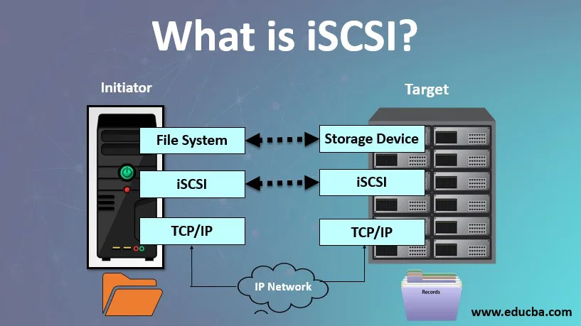
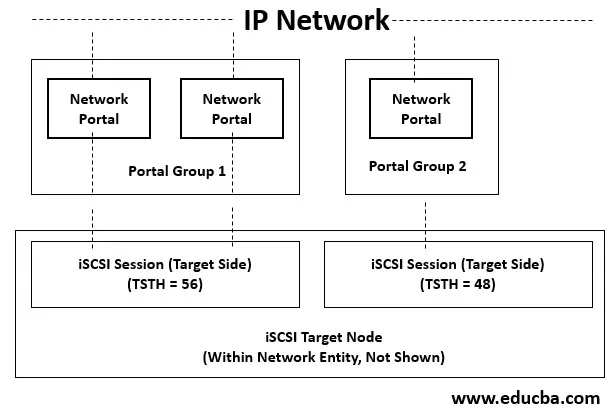

# Introduction to iSCSI

Internet Small Computer System Interface is a transport layer protocol that is built on top of TCP Protocol. It ensures data transfer between the iSCSI initiator and the storage target over the TCP/IP network at the block level. It also supports high-level encryption of the data packets that are been transferred and decryption on the arrival of data packets at the target side.

## What is iSCSI?

Internet Small Computer System Interface is a Block Transport Layer protocol that works on Block Level protocol Interface. Block protocol can also directly access the storage and control the data flow inwards or outwards through a protocol SCSI. The data from the Source and Target are herborized as they are highly encrypted at the iSCSI Initiator (source) level and decrypted upon its arrival at the iSCSI Target (destination) level. This can be considered only when there is data transfer between LAN (Local Area Network) or WAN (Wide Area Network) as the data accessing is very fast.

## How does iSCSI work?

It is a block-based set of commands that connects computing devices to network storage of media and read-write of the data. The iSCSI protocol uses initiators to send a set of SCSI commands to storage targets on the servers. These storage targets may include SAN, NAS, etc. This protocol allows storing data to remote network storage and abstracts the data for applications that require storage.

It works by transporting the data at the block-level between the initiator and target over the server on a device. The Protocol collects the set of commands and gathers the data in the form of packets that is to be transferred over the TCP/IP. These data packets are sent over the server using a single point connection. Once these data packets have arrived at the target, the iSCSI Protocol disassembles the packets by using the set of SCSI commands provided so the OS will figure out if it was a local SCSI device.

## iSCSI Architecture

In a simple word, we can say that iSCSI is a client-server architecture. The Clients of an iSCSI interface are known as “initiators” and the server that shares the storage area known as “targets”.

It is built on TCP/IP Protocol for sharing the data in the network.

## iSCSI Components

There are two most important components for iSCSI through which the data transfer happens over the network. They have been discussed briefly below:

### Initiator

These initiators group the commands into the network packets and instruct them to transfer at the iSCSI target. Generally, a software-based initiator is used at the OS to perform this data packet transport. There are also hardware devices like HBA (Host-based Adopters) with high-level encryption functionality. Another alternative to this hardware device is the iSOE card with an engine to operate from the host level which frees the CPU cycles on the host server.

### Target

iSCSI target is the storage device which is a local drive to the host system. When data packets have arrived at the target, the set of commands are executed to disassemble them in OS. If at the initiator level, the data packets are encrypted, then at the target level they are decrypted.

## Limitations and Features of iSCSI

### Limitations of iSCSI

* The main limitation of the iSCSI storage network is its performance on Fibre Channel. Now with the emerging technologies, the gap between the performances has been improved.

* Now both iSCSI and FC storage performance is almost similar to each other.
  
### Features of iSCSI

* **IP Routing**: One of the important advantages of ISCSI is that it uses TCP/IP Protocol. TCP/IP allows long-distance IP routing without the need for external gateway hardware. It also provides high flexibility and a huge storage network environment.
* **Security**: Internet Security Protocol is used for securing IP traffic in the network by authenticating and encrypting each data packets received in the network.
* **Storage array**: iSCSI targets in a large storage array. The arrays can be free software-based or commercial products. It usually provides unique iSCSI targets for the number of clients or users.
* **Standard Ethernet**: It uses Standard Ethernet and because of this, it does not require expensive components to be built for this protocol.

## Importance

* iSCSI is a storage networking protocol that works to transport the input-output data over a TCP/IP network.
* It is similar to FC Protocol that is used to transfer large data with low overhead and less latency.
* It is more beneficiaries for the users who wish the advantages of SAN, who generalized that iSCSI is better than FC.
* The block-level file sharing is more efficient and faster than any other file transfer protocol.
* iSCSI can handle natively greater distances to share the files. It is very common that the storage network can be at a certain distance from the users or clients. This can be handled by iSCSI in a much better way than FC.
* It supports CHAP (Challenge/Handshake Authentication Protocol) which ensures that a user or server has credentials to log in to a particular server on a SAN.

## iSCSI Benefits

* Cost-Effective: It provides a cheap connectivity network as compared to FC to transfer the files at the block level.
* Reusability: An existing server can be reused to configure iSCSI implementation.
* Efficient: As iSCSI is used for block storage, it is very fast.
* Reliable: Users don’t need much knowledge of the iSCSI storage system as it is very easy to understand and configure.
* Leverage: it is an internet-based protocol. It leverages the interoperability benefits of TCP/IP and Ethernet.

## Conclusion

The networks that support ISCSI should be kept away from external sources or access for the best practice. The main security risk in iSCSI SANs is that hackers can hack the stored data over the system or the server. With ACLs (Access Control Lists), storage admins can take precautions to lock the user privileges information.
