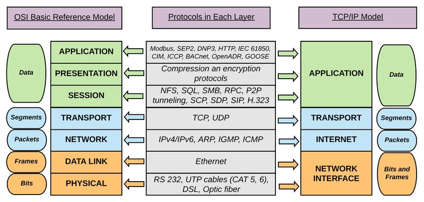

# TCP/IP networking reference guide

## Introduction

This reference guide will discuss the basics of TCP/IP networking. Although intended for an audience of Linux users and administrators, the contents of this will apply equally to other operating systems or networking devices. A future tutorial will provide the specific commands and files which provide the configuration on Linux systems.

Although there are other types of network this guide will only cover TCP/IP networking. With the success of the Internet this is the dominant protocol in use almost exclusively today.

This is primarily aimed at the current IP Version 4, although an introduction to IP Version 6 is included. A shortage of remaining IPV4 addresses is encouraging a more agressive push towards IPV6 over the next few years.

## TCP/IP Networking

TCP/IP is an abbreviation for Transmission Control Protocol / Internet Protocol. It is a set of protocols that define how two or more computers can communicate with each other. The protocol is effectively a set of rules that describe how the data is passed between the computers. It is an open standard so can be implemented on any computer with the appropriate physical attributes. Within the TCP/IP networking protocol there are lots more protocols. These provide different functionality important to the exchange of data over the networks. These can be integral to the operation of the networking, such as the Domain Name System or could be an application that uses the network such as E-mail (both of these are discussed in further detail later).

Another related protocol is UDP (User Datagram Protocol) which also runs on top of the IP (Internet Protocol). The difference between TCP and UDP is that TCP is connection based protocol whereas UDP is connectionless. In other words when TCP is being used there is a session setup between the hosts and the transfer is guaranteed. For UDP each data packet is sent but there is no checking that it has been received, or anyway of resending within the network layers. An application can run on top of UDP and implement it's own checking that each packet is received, but that is not the same as leaving it to the networking stack to implement.

A common way of comparing these is to liken TCP to the telephone system and UDP to the postal service. With the telephone when you establish a connection with the other person, you know for certain that the user receives the message. If you were disconnected during the telephone conversation then you would know about it and be able to phone the other person again. With the postal system after you post the letter then you do not know for certain whether or not the mail will be received. After you have posted the letter it could be lost or destroyed on it’s way to it’s destination. Or if the person has moved house they may never receive the letter.

At first it may sound that there is no reason to choose UDP over TCP after all if you can have the extra reassurance then why would you care about UDP. The reason for this is that there is a lot of overhead involved in TCP. For each data packet being sent a confirmation has to be generated and even if there is no data being sent there will often be some kind of keep alive signal. Whereas for some less important data you may just want to send and forget it with the hope it will reach the other end. It's also possible for the sesssion to be handled higher up the networking stack (but I'm getting ahead of myself here).

## OSI Model

Networking protocols are often described relating to the OSI model. This is a model to describe the different networking functionality by the Open Standards Institute. The OSI model splits the different functions of networking into different layers. By describing the networking protocols in layers it allows the layer to be changed without affecting other layers. For example when using a different physical connections (e.g. fibre rather than copper), then different signals need to be sent over the cable, but as long as it interacts in the same way with the layers above it then it can still function.

The networking models are particularly useful in that it allows the protocol to be implemented on any system. Allowing UNIX computers to talk as a peer with windows computers or mainframes.

### OSI 7-Layer Model

| 7    | Application  |
| ---- | ------------ |
| 6    | Presentation |
| 5    | Session      |
| 4    | Transport    |
| 3    | Network      |
| 2    | Data link    |
| 1    | Physical     |

Figure 1: OSI 7-Layer Model

The above diagram shows the 7 layer model. Starting from the bottom the function of the layers is as follows:

**Physical Layer** - describes the media over which the data travels. For instance this describes the voltage of a 1 or 0 signal across a copper wire.

**Data Link Layer** - describes the means by which the bits are carried across the physical layer. For example this can describe how the start and end of a data stream is indicated.

**Network Layer** - this layer handles the routing of data through a network. As an example this describes how routing can happen based upon the address of the computers.

**Transport Layer and Session Layer** - the transport and session layers provide end-to-end session integrity. This includes keep alives to ensure the connection is maintained.

**Presentation Layer and Application Layer** - These provide the interface to the application. For example this may include the use of the nslookup command to convert a hostname into an IP address.

Whilst the TCP/IP protocol does not exactly match the OSI 7 layer model it can be approximately mapped across onto it. The following diagram shows the TCP/IP stack compared with the OSI 7 layer model.

|      | OSI model    | TCP/IP stack      |
| ---- | ------------ | ----------------- |
| 7    | Application  | Application       |
| 6    | Presentation |                   |
| 5    | Session      | TCP or UDP        |
| 4    | Transport    |                   |
| 3    | Network      | IP                |
| 2    | Data link    | Network interface |
| 1    | Physical     | Physical          |

Figure 2: TCP/IP Stack Alongside the OSI 7 Layer Model

This model shows how the TCP/IP protocols are mapped onto the 7-layer model. Note that the application and presentation layers have been merged and that the session and transport layers have been merged. The distinction between these layers are not needed in the TCP/IP model. There is an exception in the NFS application in that it sits on top of the SUN RPC protocol which functions as a presentation layer, however for most purposes they are considered as a single layer. Also the borders between the layers are not as rigidly defined in the TCP/IP as in the OSI model and the functions are not neccessarily a direct match between the OSI model.

Knowing the layers of the network model can however be useful when trying to pin down a certain problem. If you can determine that connectivity is working at a certain level within the stack then you can restrict future investigations to the remaining areas.

## More about TCP/IP

TCP/IP was originally developed for universities and the military to exchange ideas and files. The development of TCP/IP is initiated by the Internet Architecture Board (IAB), and the development of standards is handled by the Internet Engineering Task Force (IETF). The documents produced by the IAB are called Request For Comments (RFC) which describe the protocols and relevant information useful for the implementation. Anyone can submit a document as an RFC which are reviewed before being published as official RFC’s. After an RFC is published and assigned an RFC number is its never revised under the same number. Instead a new RFC must be created which supersedes the previous version.

## IP Addressing Scheme

An important part of all networking protocols is the addressing scheme. Without being able to locate the individual machines (or hosts as they are called) then it would not be possible for any communication between the hosts. There will be more than one addressing scheme in use but the most important of these is the Internet Protocol (referred to as IP), this is significant as it provides the addressing for each end of the connection. The other addressing schemes are effectively hidden from the user at layers two or below and are automatically handled by the networking hardware. The current version of IP is called IP version 4 but will be replaced by IPV6 in future. When I refer to IP it refers to version 4 unless otherwise specified.

The addresses used in the Internet Protocl consist of four octets and is 32 bits long. The address is stored in a format known as dotted decimal.

ie.xxx.xxx.xxx.xxx

where xxx is a number between 0 and 255.

So an example IP address may be: 192.168.3.27

Most users however would not actually need to use the IP address. Instead they would refer to the computer using it’s host name. The IP address is obtained from the host name using the "Domain Name System" (DNS). There is no actual relationship between the hostname and the IP address instead this uses a lookup table. The Domain Name Service will be discussed later.

The IP addressing scheme provides 232 possible addresses, which could potentially have over 4.2 thousand million individual addresses. The problem with this however is that trying to locate each one of those addresses individual over the Internet would be an enormous task. So instead the address is split into a network and a host portion. The idea being that different organisations can be assigned a network which can have between 256 and 16.7 million addresses available for hosts. The address range now allows up to 3.7 thousand million hosts on 2.1 million networks.

To accommodate for different sized organisations which require a different number of host addresses, the addresses are split into different network classes. There are 5 different classes however only 3 are commonly used.

**Class A** - These are for large organisations. The network portion is 8 bits long and begins with binary 0. There are 126 possible networks each with up to 16.7 million hosts.

**Class B** - These are for medium sized organisations. The network portion is 16 bits long and starts with binary 10. There are 16 thousand networks each with up to 65 thousand hosts. In reality the definition of a medium sized organisation would be a very large company

**Class C** - These are for smaller organisations. The network portion is 24 bits long and begins with binary 110. There are 200 thousand possible networks each with up to 254 hosts. In reality even these are quite large, so are often split further (see later).

**Class D** - These are allocated for multicast although are rarely used. The addresses begin with binary 1110.

**Class E** - These are experimental. The addresses begin with binary 1111.

### IP Address class ranges

| Class A | 0.hhh.hhh.hhh   | to   | 127.hhh.hhh.hhh |
| ------- | --------------- | ---- | --------------- |
| Class B | 128.nnn.hhh.hhh | to   | 191.nnn.hhh.hhh |
| Class C | 192.nnn.nnn.hhh | to   | 223.nnn.nnn.hhh |
| Class D | 224.xxx.xxx.xxx | to   | 239.xxx.xxx.xxx |
| Class E | 240.xxx.xxx.xxx | to   | 255.xxx.xxx.xxx |

Figure 3: IP address class ranges

In the above table the nnn represent the network portion of the address and the hhh represent the host portion of the address.

The observant, mathematically minded my have noticed that some of the numbers mentioned earlier appear to be incorrect. Some of these are through rounding down, but others are due to certain addresses being reserved for other uses.

### Reserved Addresses

| 127.0.0.1               | Refers to localhost                       |
| ----------------------- | ----------------------------------------- |
| All host bits binary 0s | Refer to the network                      |
| All host bits binary 1s | Broadcast address - send to all addresses |

### Private Address Ranges (defined in RFC 1918)

| Class A | 10.0.0.0    | to   | 10.255.255.255  |
| ------- | ----------- | ---- | --------------- |
| Class B | 172.16.0.0  | to   | 172.31.255.255  |
| Class C | 192.168.0.0 | to   | 192.168.255.255 |

The private address ranges are for use internally within an organisation. They cannot be used on the Internet. To provide Internet access for a host with a private address range the communications have to go through a NAT (Network Address Translation). This is one way that the number of available IP addresses can be preserved.

Apart from the private address ranges all other IP addresses need to be registered with the InterNIC before they can be used.